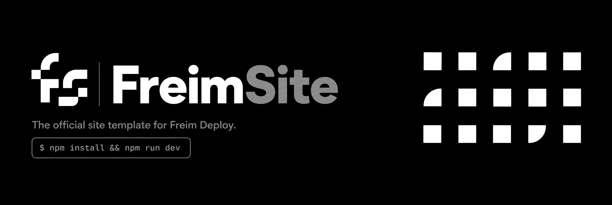
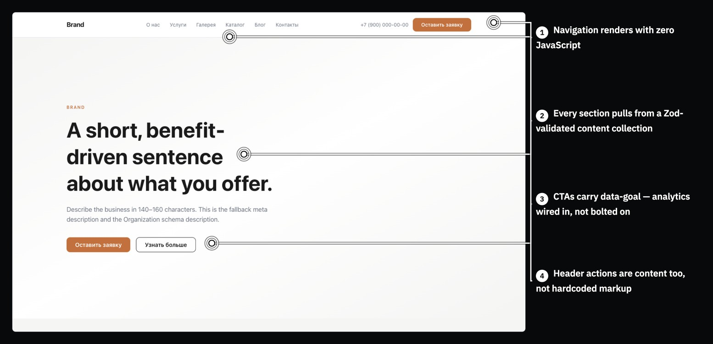
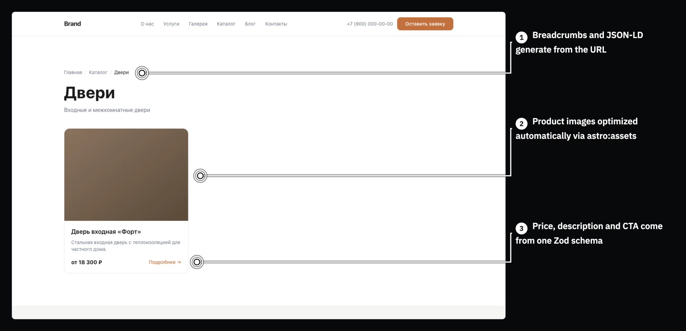
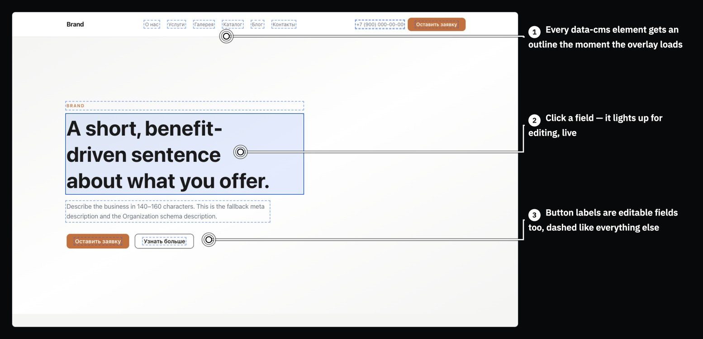

<div align="center">



<!-- Картинка для соцсетей GitHub: assets/social-preview.jpg — прописывается в
     Settings → General → Social preview, когда файл появится. -->

<h3>Официальный шаблон сайта для Freim Deploy.</h3>

<p><b>Репозиторий превращается в живой сайт на своём домене — а дальше клиент<br>
сам правит контент, кликая прямо по странице, без админки и без кода.</b></p>

<p>
  <a href="LICENSE"></a>
  
  
  <a href="https://github.com/ARTFROST1/FreimSite/generate"></a>
</p>

<p>
  <a href="README.md"></a>
  <a href="README.ru.md"></a>
</p>

</div>

---

## 🧊 Что это такое

Freim Deploy — self-hosted деплой-платформа: свой «Vercel» на собственном VDS — Node 22,
SQLite, [Caddy](https://caddyserver.com) и systemd, без Docker. FreimSite — это то, что
на неё выкатывают.

Смысл шаблона держится на связке из трёх шагов:

1. **Вы берёте этот репозиторий** и за один присест превращаете его в конкретный
   сайт — цвета, контент, страницы, — а не собираете с нуля.
2. **Подключаете к Freim Deploy.** Пуш в ветку — и панель сама собирает сайт, выпускает
   HTTPS-сертификат и ставит его на домен клиента.
3. **Клиент правит сайт сам.** Он открывает свой же сайт через CMS-портал, кликает по
   заголовку или цене точно так же, как кликнул бы по ним как посетитель, вводит новый
   текст, жмёт «опубликовать». Правка коммитится в Git и разворачивается заново — без
   редактора кода и без админки, которую пришлось бы объяснять.

Третий шаг — не украшение сверху, а причина, по которой шаблон вообще существует
отдельным продуктом: каждый редактируемый блок на сайте размечен так, чтобы этот шаг был
возможен технически, а не только на словах.

<div align="center">







</div>

*Демо-контент на скриншотах — на русском: это первое, что вы замените на своё; код, схемы
и документация от языка не зависят.*

> [!NOTE]
> **Почему файл деплоя называется `frostdeploy.json`.** Это не забытое переименование.
> Платформа, под которую собран этот шаблон, — Freim Deploy — раньше называлась
> FrostDeploy, и имя файла-манифеста ребрендинг намеренно не тронул: серверы, уже
> установленные у клиентов, читают ровно это имя файла, когда проверяют и накатывают
> собственные обновления, и переименование здесь молча сломает именно это.
> `frostdeploy.json` держит имя не по инерции — подробности в разделе
> [«Деплой»](docs/en/deploy.md) ниже.

---

## 🚀 Быстрый старт

```bash
git clone https://github.com/ARTFROST1/FreimSite.git my-site
cd my-site
npm install
npm run dev
```

На `http://localhost:4321` сразу поднимается полноценный демо-сайт: главная, «О нас»,
галерея, контакты, блог с пагинацией и небольшой каталог товаров — всё на плейсхолдерном
контенте, готовое к замене на настоящий.

Полный разбор, требования и таблица команд — **[docs/en/quick-start.md](docs/en/quick-start.md)**
(страница на английском, но команды универсальны).

---

## ✨ Что внутри

|  | Возможность | Что это значит на практике |
| :-: | --- | --- |
| 🔍 | **SEO без компромиссов** | Единый SEO-мап, canonical, OG/Twitter-карточки, hreflang, гео-теги, JSON-LD для Organization, WebSite, LocalBusiness, BreadcrumbList, FAQPage и BlogPosting, sitemap, RSS и пинг IndexNow — встроено, а не прикручено сбоку |
| 🧩 | **Двадцать контент-коллекций под Zod** | Каждый редактируемый блок — hero, преимущества, отзывы, тарифы, каталог товаров, блог — сначала описан схемой: опечатка в поле валит сборку, а не улетает в продакшен пустой строкой |
| 🏝 | **Острова, а не приложение** | Astro рендерит страницу в HTML на этапе сборки; React подключается только там, где нужна настоящая интерактивность (валидируемая форма, лайтбокс) |
| 📬 | **Лидоген, реально закалённый** | Двухшаговая форма заявки, попап с exit-intent, промо-баннер и серверный пайплайн с уведомлениями через ботов и honeypot-защитой от спама |
| 🎛 | **Медиа и UI без налога на React** | Лайтбокс, карусель, табы, модалка, видео-эмбед, «до/после», карта и ещё десяток виджетов — всё на ваниль-JS, всё переживает SPA-навигацию |
| 📈 | **Аналитика с реестром целей** | Яндекс.Метрика подключена через один декларативный атрибут `data-goal`, а не разбросанные по коду вызовы трекера |
| 🧱 | **Живая витрина компонентов** | Все секции и UI-примитивы на одной странице `/ui-kit/` (закрыта от индексации) — справочник, из которого копируют, пока строят сайт |

---

## 📝 CMS

Клиент никогда не открывает этот репозиторий. Он открывает свой сайт через **CMS-портал
Freim Deploy**, который читает контракт, генерируемый шаблоном специально для него
(`content.schema.json`), и превращает каждый элемент с атрибутом `data-cms` в кликабельный:
клик — подсвечивается нужное поле формы, правка — текст на странице меняется вживую, без
перезагрузки. «Опубликовать» коммитит изменение в Git.

Как завести новый редактируемый блок под этот контракт — схема, JSON, разметка `data-cms`,
тест-страж, который ловит поломку разметки при рефакторинге, — расписано целиком:
**[docs/en/cms.md](docs/en/cms.md)** (страница на английском) и подробнее, по-русски, в
[docs/CMS-BUILDING.md](docs/CMS-BUILDING.md).

---

## ☁️ Деплой

Шаблон рассчитан на деплой в **Freim Deploy**
([github.com/ARTFROST1/FreimDeploy](https://github.com/ARTFROST1/FreimDeploy)) — ставите
панель на свой VDS, подключаете этот репозиторий, жмёте «Deploy». Шаблон при этом ничем
не заперт на платформу: подойдёт что угодно, что умеет выполнить `npm run build` и отдать
статику (или держать процесс Node живым). Единственный файл, написанный специально под
платформу, — `frostdeploy.json`, разобранный выше и целиком —
в **[docs/en/deploy.md](docs/en/deploy.md)**.

---

## 📚 Документация

Основная документация этого шаблона — на русском, и это не потому, что до английской
не дошли руки: десять больших документов и рецепты одновременно служат рабочими
заметками автора, которые естественно ведутся на родном языке. Пять страниц ниже —
не более чем прихожая на английском, для тех, кто по-русски не читает вовсе, включая
ИИ-агента, которому просто прислали ссылку на репозиторий без контекста:

| Страница | Что внутри |
| --- | --- |
| [Quick start](docs/en/quick-start.md) | Установка, запуск, справочник команд, что уже есть в демо-сайте |
| [Structure](docs/en/structure.md) | Карта каталогов и почему сайт по умолчанию отдаёт ноль килобайт JS |
| [Content](docs/en/content.md) | Контент-коллекции, схемы Zod за ними, как добавить свою |
| [CMS](docs/en/cms.md) | Контракт, по которому клиент правит контент через портал |
| [Deploy](docs/en/deploy.md) | `frostdeploy.json` по полям и почему его имя не меняется никогда |

> [!NOTE]
> **Вам, скорее всего, эти пять страниц не нужны — идите сразу в источники.** Десять
> документов под [`docs/`](docs/) — [архитектура](docs/ARCHITECTURE.md), [политика
> контента](docs/CONTENT.md), [как строится CMS-разметка](docs/CMS-BUILDING.md),
> [картинки](docs/IMAGES.md), [SEO](docs/SEO.md),
> [производительность](docs/PERFORMANCE.md), [юридические требования](docs/LEGAL.md),
> [пособие по сборке сайтов](docs/GUIDE.md), [плейбук для агента](docs/AGENT-PLAYBOOK.md)
> и [грабли аналитики](docs/ANALYTICS-PITFALLS.md) — плюс двадцать три боевых
> **[рецепта](docs/recipes/README.md)**: лид-пайплайн, товарные фиды, скролл-сцены и
> другое. Это не сокращённый вариант пяти страниц выше, а полноценная документация: те
> же темы разобраны подробнее, и добавлены темы, которых в английской прихожей нет
> вовсе, — лидоген, аналитика, 152-ФЗ.

---

## 📄 Лицензия

[MIT](LICENSE) — используйте, форкайте, адаптируйте, ставьте в клиентские проекты, в том
числе коммерческие. Указание авторства не обязательно, но ссылка назад всегда приятна.

<div align="center">
<br>

**[🚀 Быстрый старт](docs/en/quick-start.md)** · [CMS](docs/en/cms.md) · [Деплой](docs/en/deploy.md) ·
[Freim Deploy](https://github.com/ARTFROST1/FreimDeploy) ·
[Задать вопрос](https://github.com/ARTFROST1/FreimSite/issues/new/choose)

[English](README.md) · [Русский](README.ru.md)

<sub><b>FreimSite</b> — официальный шаблон сайта для <b>Freim Deploy</b>, self-hosted
деплой-платформы. Astro 7, ноль JavaScript по умолчанию, двадцать контент-коллекций под
Zod-схемами и контракт click-to-edit CMS из коробки.</sub>

<sub>© 2026 ARTFROST1</sub>

</div>
